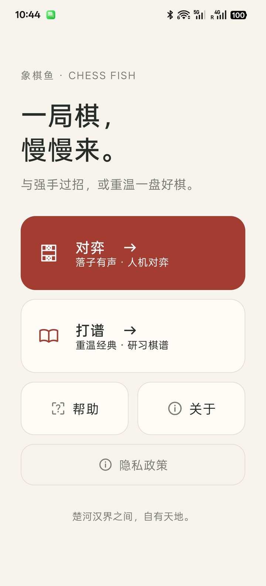
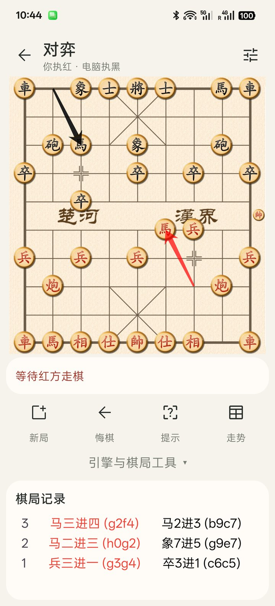
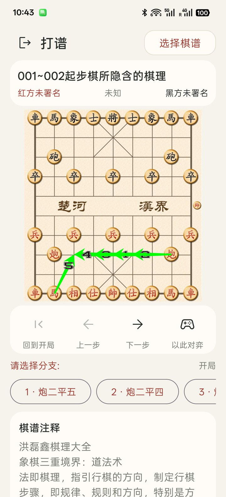
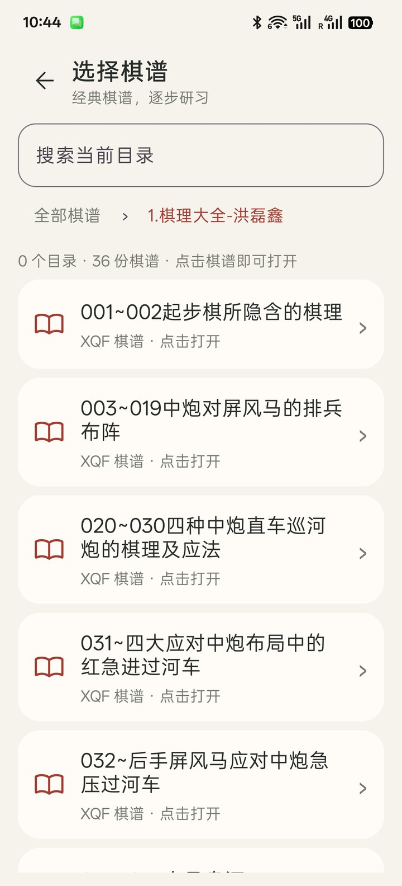
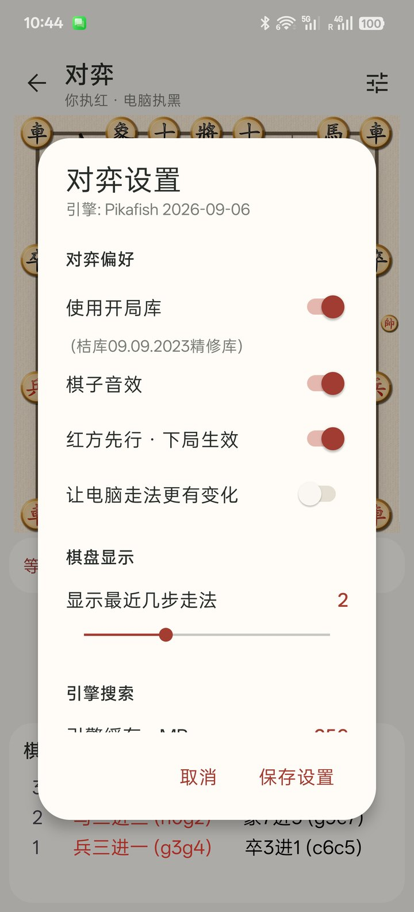
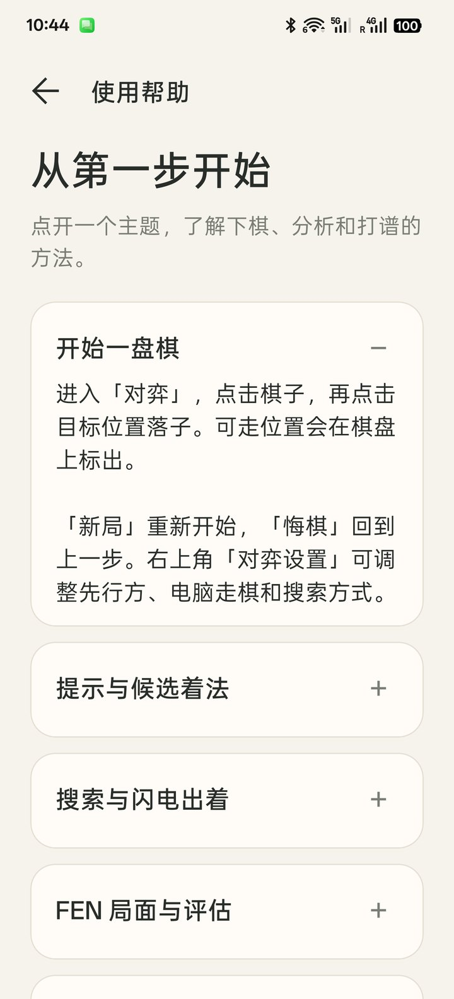

# 象棋鱼

[](https://github.com/zfdang/chinese-chess-fish-android/actions/workflows/android.yml)

开源免费的 Android 中国象棋学习工具。与皮卡鱼过招，在经典棋谱中研习，让手机成为随身棋盘。

[项目官网](https://fish.zfdang.com/) · [下载最新版本](https://github.com/zfdang/chinese-chess-fish-android/releases/latest) · [使用帮助](https://fish.zfdang.com/help.html) · [问题反馈](https://github.com/zfdang/chinese-chess-fish-android/issues)

## 功能

- **对弈**：人机对弈、执棋模式、悔棋、历史着法，显示落子轨迹与棋子可移动位置。
- **分析**：Pikafish（皮卡鱼）引擎提示、候选着法、局势评估曲线，可调整搜索深度、时间与缓存。
- **棋局工具**：导入和复制 FEN 局面，从指定位置继续对弈。
- **打谱**：内置 XQF 棋谱，按目录浏览、搜索当前目录、逐步回放、选择分支、阅读注释，也可从棋谱局面开始对弈。
- **离线使用**：内置引擎、棋谱、帮助、关于和隐私政策可离线使用；云开局库查询需要联网。

新版界面采用纸色背景与红色重点色，常用操作集中显示，更多工具按需展开。打谱时棋盘高度保持稳定，分支与注释较多时可以滚动页面。

## 界面预览

以下为 2026 年 10 月 6 日 Android 真机截图，点击可查看图片。

| 首页 | 对弈 | 打谱 |
| --- | --- | --- |
| [](docs/images/home.jpg) | [](docs/images/game.jpg) | [](docs/images/manual.jpg) |

| 棋谱选择 | 对弈设置 | 离线帮助 |
| --- | --- | --- |
| [](docs/images/picker.jpg) | [](docs/images/settings.jpg) | [](docs/images/help.jpg) |

## 下载与安装

适用于 **Android 8.0（API 26）及以上的 ARM64 设备**。

在 [GitHub Releases](https://github.com/zfdang/chinese-chess-fish-android/releases/latest) 的 Assets 中选择安装包，或访问[官网本地下载目录](https://fish.zfdang.com/apk/)。本地目录更新可能晚于 GitHub。

| 安装包 | 适用设备 |
| --- | --- |
| `chessfish-armv8.zip` | ARM64 通用版，不确定设备指令支持时优先选择 |
| `chessfish-armv8-dotprod.zip` | 支持 ARM dotprod 指令的设备；如无法正常运行，改用通用版 |

下载 ZIP 后解压，打开其中的 APK，按 Android 提示完成安装。更新时请选择相同版本类型。发布附件中的 AAB 用于应用商店发布，不是可直接安装的 APK。

## 从源码构建

项目包含 Pikafish 源码与 NNUE 网络文件，引擎通过 JNI 加载原生库，在独立 Android Service 进程中运行。无需额外下载引擎可执行文件。

当前构建配置：

- JDK 17
- Android SDK 36（compileSdk / targetSdk 36，minSdk 26）
- Android NDK `27.0.12077973`，通过 ndk-build 编译
- 使用仓库内的 Gradle Wrapper

安装对应 SDK 与 NDK，配置 `ANDROID_HOME` 或在 `local.properties` 中设置 `sdk.dir`，然后执行：

```sh
# 通用版调试 APK
./gradlew assembleArmv8-Debug

# dotprod 版调试 APK
./gradlew assembleArmv8-dotprod-Debug

# 单元测试与 lint
./gradlew testArmv8-DebugUnitTest lintArmv8-Debug
```

APK 位于 `app/build/outputs/apk/`。`./gradlew assembleRelease bundleRelease` 可构建两个版本的 release APK 与 AAB。

## 网站文档

`docs/` 包含官网首页、使用帮助、下载和隐私政策，以及真机截图。网页使用本地 CSS，无需前端构建步骤，可直接通过静态服务器预览：

```sh
python3 -m http.server 8000 --directory docs
```

然后访问 `http://localhost:8000/`。`docs/privacy.html` 也会在 Android 构建时打包为离线隐私政策；修改时需保留正文的 `<section>` 和 `<h4>` 结构。

## 隐私与反馈

对局记录、棋谱和设置保存在设备本地。启用云开局库时，应用会向 chessdb.cn 查询当前局面的 FEN。详细说明见[隐私政策](https://fish.zfdang.com/privacy.html)。

反馈问题时，请附上应用版本、设备型号、Android 版本和复现步骤。与棋局有关的问题，可使用「复制棋局」提供 FEN。

## 开源与致谢

希望更多人参与，打造一个好用的 Android 中国象棋学习工具。

- [Pikafish](https://github.com/official-pikafish/Pikafish)：中国象棋引擎，相关说明与许可见 [引擎 README](app/src/main/cpp/pikafish/README.md) 和 [COPYING](app/src/main/cpp/pikafish/Copying.txt)。
- [DroidFish](https://github.com/petero/droidfish)：引擎通信相关代码参考。
- [ChineseChess](https://github.com/kongxiangchx/ChineseChess)：Android 中国象棋项目参考。
- [cchess](https://github.com/walker8088/cchess)：Python 中国象棋库参考。
